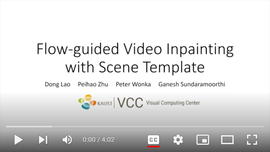

# Flow-guided Video Inpainting With Scene Template

This is the demo code for 'Flow-guided Video Inpainting With Scene Template (ICCV 2021)'. We propose a flow-based solution to video inpainting by introducing the scene template, a 2D representation of the scene based on a layered formulation. This reduces geometric distortions in flow-based inpainting, creating consistent and crisp inpaintings results.

  
Now a Matlab demo can be downloaded from [Google Drive](https://drive.google.com/file/d/1sj1ef5BzlSKK9qwFE37l89Hsgw2ZI1yt/view?usp=sharing).

## Fun Stuff

